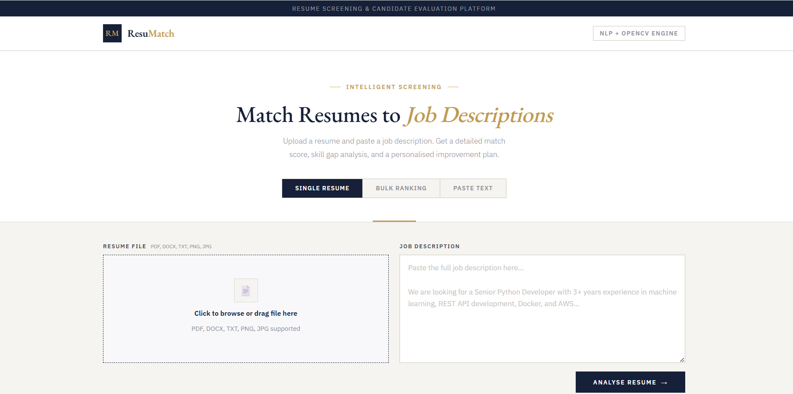
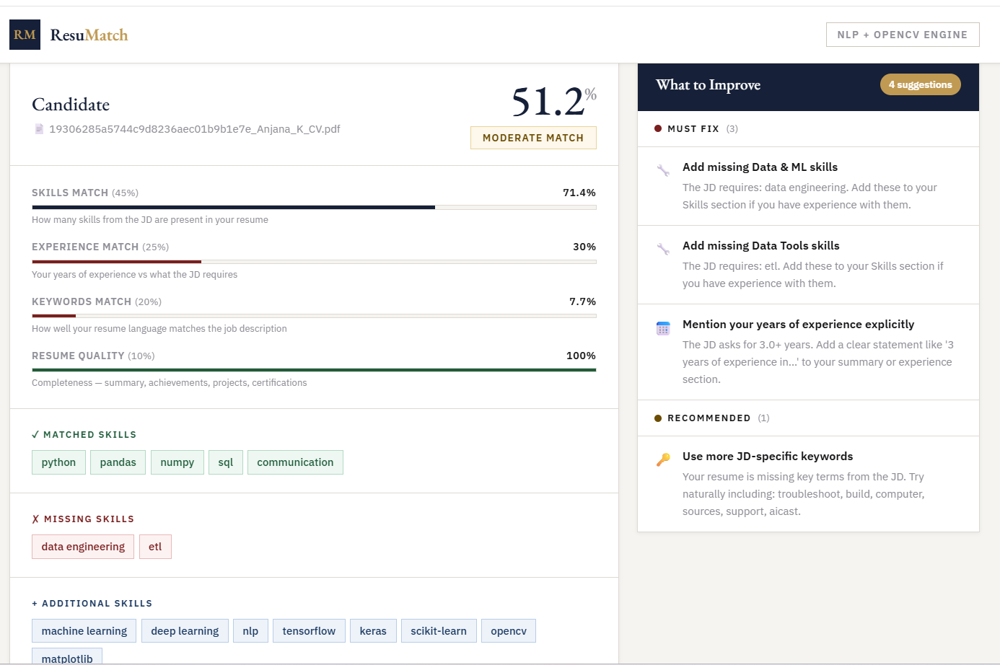

# 🤖 AI Resume Matcher

An intelligent web application that analyzes resumes against job descriptions using Natural Language Processing (NLP) and machine learning techniques.

---

## 🚀 Live Demo

🌐 [https://ai-resume-matcher-da52.onrender.com]

---

## 📌 Overview

The AI Resume Matcher helps job seekers evaluate how well their resume matches a given job description. It provides:

* 📊 Match score
* ✅ Skill alignment
* ❌ Missing skills
* 📈 Resume ranking (bulk mode)

---

## ✨ Features

* 🔍 **Resume Parsing**

  * Supports PDF, DOCX, TXT, and image formats
* 🧠 **NLP-Based Skill Extraction**
* 📊 **Semantic Matching Engine**
* 📂 **Bulk Resume Ranking**
* 📄 **Text-based Resume Analysis**
* 🌐 **Web Interface with Flask**

---

## 🛠️ Tech Stack

| Category      | Tools Used         |
| ------------- | ------------------ |
| Backend       | Flask (Python)     |
| NLP           | spaCy / Custom NLP |
| ML            | Scikit-learn       |
| File Handling | PyPDF2, pdfplumber |
| Frontend      | HTML, CSS          |
| Deployment    | Render             |

---

## 🧠 How It Works

1. Upload a resume or paste resume text
2. Provide a job description
3. System extracts:

   * Skills
   * Education
   * Experience
4. Computes similarity score using NLP techniques
5. Outputs:

   * Match percentage
   * Missing skills
   * Recommendations

---

## 📂 Project Structure

```bash
AI-Resume-Matcher/
│── app.py
│── resume_processor.py
│── requirements.txt
│── templates/
│── uploads/
```

---

## ⚙️ Installation & Setup

### 1️⃣ Clone the repository

```bash
git clone https://github.com/ANJANA-K-HUB/AI-Resume-Matcher.git
cd AI-Resume-Matcher
```

---

### 2️⃣ Install dependencies

```bash
pip install -r requirements.txt
```

---

### 3️⃣ Run the application

```bash
python app.py
```

---

### 4️⃣ Open in browser

```text
http://localhost:5000
```

---

## 🌍 Deployment

This project is deployed using **Render**.

To deploy:

1. Connect GitHub repo to Render
2. Set build command:

   ```bash
   pip install -r requirements.txt
   ```
3. Set start command:

   ```bash
   python app.py
   ```

---

## 📸 Screenshots

### 🏠 Home Page


### 📊 Result Page

---

## 🎯 Use Cases

* Job seekers improving resumes
* Recruiters screening candidates
* Students preparing for placements

---

## 🔮 Future Improvements

* 🔐 User authentication
* 📊 Advanced analytics dashboard
* 🤖 LLM-based feedback (GPT integration)
* 📱 Mobile-friendly UI

---

## 👤 Author

**Anjana K**

* GitHub: https://github.com/ANJANA-K-HUB
* LinkedIn:https://www.linkedin.com/in/anjana28/

---

## ⭐ If you like this project

Give it a ⭐ on GitHub and share your feedback!

---
